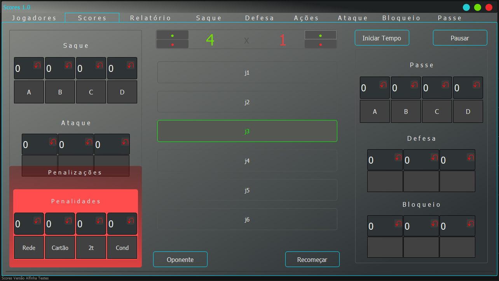
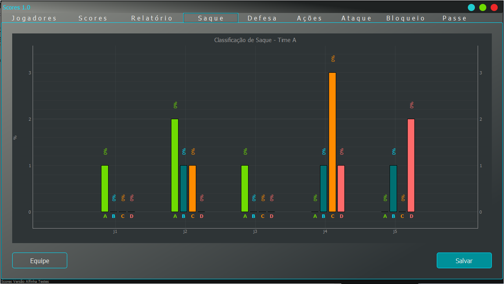
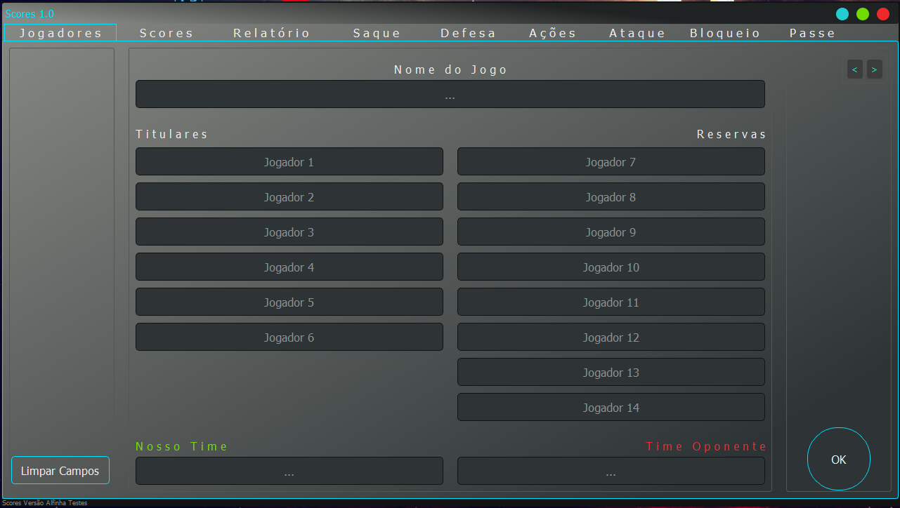

# Contado de Pontuações
Um contador para jogos de volei. Permite segmentar áreas da quadra e medir desempenho individual de cada jogador.

Menu de distribuição de pontos e regiões da quadra.

Alguns gráficos de segmentação.

Menu de cadastro de jogadores.
